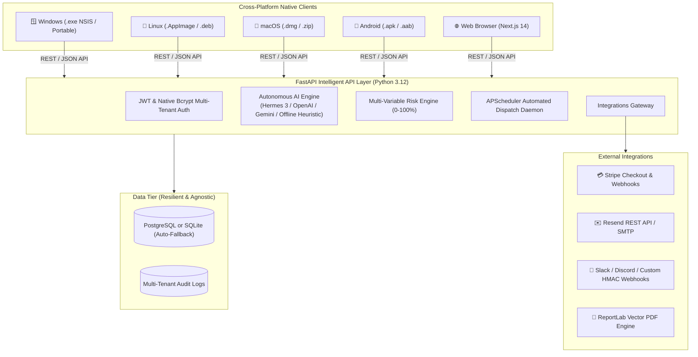

# ⚡ Invoice Chaser — Autonomous Accounts Receivable & Payment Recovery Engine

[](https://github.com/abusuraihsakhri/invoice-chaser/releases)
[](https://github.com/abusuraihsakhri/invoice-chaser/actions/workflows/release.yml)
[](https://github.com/abusuraihsakhri/invoice-chaser/actions/workflows/ci.yml)
[](#-cross-platform-distribution)
[](LICENSE)

**Invoice Chaser** is an enterprise-grade, autonomous accounts receivable (AR) automation system designed to eliminate manual collection follow-ups and accelerate cash flow. Powered by an intelligent API layer, multi-provider AI risk scoring, automated Stripe checkout generation, and native builds across **Windows**, **Linux**, **macOS**, and **Android phones**.

---

## 🌟 Key Highlights

- 🤖 **Autonomous AI Tone Escalation**: Proactively transitions reminders through 6 distinct stages (`friendly` -> `professional` -> `firm` -> `urgent` -> `final` -> `legal`) based on debtor behavior and payment delays.
- 🎯 **Predictive Default Risk Scoring (0–100%)**: Multi-variable credit risk engine projecting payment default probability, expected delay days, and automated collection strategy.
- 💳 **1-Click Stripe Checkout Integrations**: Generates hosted Stripe Checkout URLs embedded directly into reminder emails and client views.
- 📄 **Branded Vector PDF Invoices**: Programmatic, print-ready PDF invoice generation via ReportLab with real-time status badges and payment links.
- ⚙️ **Custom Business Rules & Templates**: Configurable invoice payment terms, reminder intervals, and branded message templates.
- 💬 **Smart Dispute Rebuttal & Payment Plans**: Automatically drafts legally sound rebuttals to client delay tactics and generates structured installment plans.
- 🔔 **Multi-Channel Dispatch**: Transactional emails via **Resend API** or **SMTP** (Gmail/SES/Outlook), plus real-time team notifications via **Slack**, **Discord**, and **HMAC-signed Webhooks**.
- 🗄️ **Zero-Config Resilient DB**: Seamlessly connects to **PostgreSQL** in production or auto-initializes local **SQLite** (`invoice_chaser.db`) in offline/dev mode.
- 📱 **True Cross-Platform**: Native desktop installers for Windows, Linux, and macOS via Electron 31, and native Android APK packaging via Capacitor 6.

---

## 🏗️ System Architecture



---

## 📱 Cross-Platform Distribution

| Operating System | Package Target | Binary Artifact | Runtime Engine |
|---|---|---|---|
| **Windows** | x64, arm64 | `Invoice-Chaser-Setup-1.0.0.exe`, Portable `.exe` | Electron 31 + Chromium |
| **Linux** | x64, arm64 | `Invoice-Chaser-1.0.0.AppImage`, `.deb` package | Electron 31 + GTK3 |
| **macOS** | Universal (Intel / Apple Silicon) | `Invoice-Chaser-1.0.0.dmg`, `.zip` | Electron 31 + Cocoa |
| **Android Phones** | Android 7.0+ (API 24–34) | `Invoice-Chaser-v1.0.0.apk` | Capacitor 6 + Android WebView |
| **Web Browser** | Chrome, Firefox, Safari, Edge | Responsive PWA / Static Export | Next.js 14 + Tailwind CSS |
| **Backend Service** | Linux / Docker / Cloud | Container / Tarball Release | Python 3.12 + FastAPI + Uvicorn |

---

## 🚀 Quick Start Guide

### Prerequisites
- **Python 3.12+**
- **Node.js 20+** and **npm**
- *(Optional)* Android SDK 34 / Java 17 for local mobile builds

---

### 1. Backend API Layer

```powershell
# Navigate to backend directory
cd backend

# Create and activate virtual environment
python -m venv .venv
# On Windows (PowerShell):
.\.venv\Scripts\Activate.ps1
# On Linux / macOS:
# source .venv/bin/activate

# Install dependencies
pip install -r requirements.txt

# Launch FastAPI development server
uvicorn app.main:app --reload --host 0.0.0.0 --port 8000
```

- 📖 **Interactive Swagger UI**: [http://localhost:8000/docs](http://localhost:8000/docs)
- 🔍 **Health Status**: [http://localhost:8000/health](http://localhost:8000/health)

---

### 2. Frontend Web Application

```powershell
# Navigate to frontend directory
cd frontend

# Install packages
npm install

# Build static export for Electron & Android embedding
npm run build

# Or launch local web development server
npm run dev
```

- 🌐 Web Dashboard: [http://localhost:3000](http://localhost:3000)

---

### 3. Desktop Application (Windows, Linux, macOS)

```powershell
# Navigate to desktop directory
cd desktop

# Install desktop dependencies
npm install

# Launch Electron in development mode
npm start

# Package for your operating system:
npm run build:win     # Generates Windows NSIS installer & portable .exe
npm run build:linux   # Generates Linux AppImage & .deb
npm run build:mac     # Generates macOS universal .dmg
```

Compiled binaries will appear in `desktop/dist/`.

---

### 4. Android Mobile Application

```powershell
# Sync the static web build to the Android project
npx cap sync android

# Open project in Android Studio
npx cap open android

# Or build debug APK directly via command line
cd android
.\gradlew.bat assembleDebug
```

Output APK will be generated at:
`android/app/build/outputs/apk/debug/app-debug.apk`

---

## ⚙️ Environment Configuration

Create a `.env` file in the `backend/` directory or export variables:

| Variable | Default | Purpose |
|---|---|---|
| `DATABASE_URL` | `sqlite:///./invoice_chaser.db` | Database connection URI (PostgreSQL or SQLite) |
| `SECRET_KEY` | *(Auto-generated safe random)* | JWT encryption signing key |
| `ALGORITHM` | `HS256` | JWT signature algorithm |
| `ACCESS_TOKEN_EXPIRE_MINUTES` | `10080` (7 days) | User session token validity window |
| `AI_PROVIDER` | `hermes` | AI engine: `hermes`, `openai`, `gemini`, `claude`, `offline` |
| `AI_API_KEY` | `""` | API key for configured external AI provider |
| `STRIPE_SECRET_KEY` | `""` | Stripe secret key for live payment links |
| `STRIPE_WEBHOOK_SECRET` | `""` | Stripe webhook HMAC signing secret |
| `EMAIL_PROVIDER` | `smtp` | Transactional email provider: `resend` or `smtp` |
| `RESEND_API_KEY` | `""` | Resend REST API key |
| `SMTP_HOST` / `SMTP_PORT` | `smtp.gmail.com` / `587` | SMTP mail server configuration |
| `SMTP_USER` / `SMTP_PASSWORD` | `""` / `""` | SMTP mail credentials |
| `SLACK_WEBHOOK_URL` | `""` | Outgoing Slack webhook for instant team alerts |
| `DISCORD_WEBHOOK_URL` | `""` | Outgoing Discord channel webhook |
| `GENERIC_WEBHOOK_URL` | `""` | Outgoing custom endpoint for enterprise ERPs |
| `WEBHOOK_SECRET` | `""` | HMAC SHA256 signing key for outgoing webhook payloads |

---

## 📄 License

This project is licensed under the **MIT License**. See [LICENSE](LICENSE) for details.
